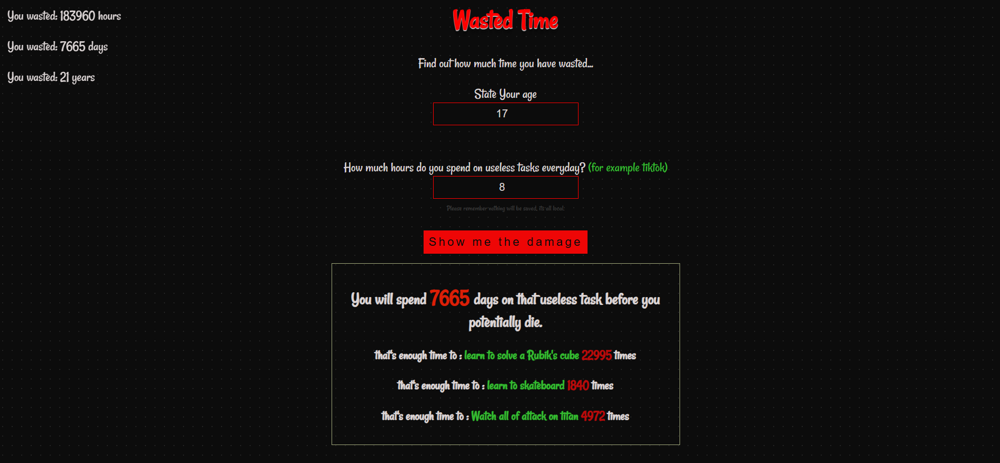

# wastedTime
a simple web app where you enter how much time you spend on your apps daily. and you find out how many days of your life you are wasting... 

### how to try it?
to run this locally simply download the file from github or clone it using git clone (link) then once everything is installed on your computer simply open the "index.html" file, you do not need to install anything as this can simply run on ur browser.

otherwise you can try it here
[TRY HERE](https://wasted-time.vercel.app/)

### FEATURES
- inputs where you can input ur age and hours spent on a useless app/ activity
- calculation that shows you how many days of ur life u will waste on that exact activity
- shows randomly using an array of objects a comparasion of things you could have done instead
- made to made u think about how much time you waste and other things you couldve done instead(like instead of doomscrolling)
- your age is very obviusly not saved when you input it, if it wasn't obvious

### how does it work
1) math part(logic) ; i take the inputs you wrote on the age and hours app, i then calculate the years you have left to live ( judging by the fact 80 is SOMEWHAT average).. then i multiply by 365 and your daily hours to get lifetime hours, then convert it to days.

2) comparasions : i have a array of objects that are all different activities categorized by the activity and the hours u need to complete it, the array gets shuffled randomly every time the button is pressed and i pick the first 3 then i calculate how many times the user based on his hours could have done that activities(before 80 yo)

### things i learned
1) manipulation of innerHTML and the difference between innerhtml and textcontent

2) how to use span inside strings to style specific parts, in my case change text colors

3) how to shuffle arrays

4) using radial gradient to make a dotted background

5) learning how to import different google fonts and use it's effects

### conclusion
its a really small project nothing special, i hope it made you understand the gravity of the time you waste and maybe u will stop doomscrooling for like.. 3 minutes after this? well probably not.
